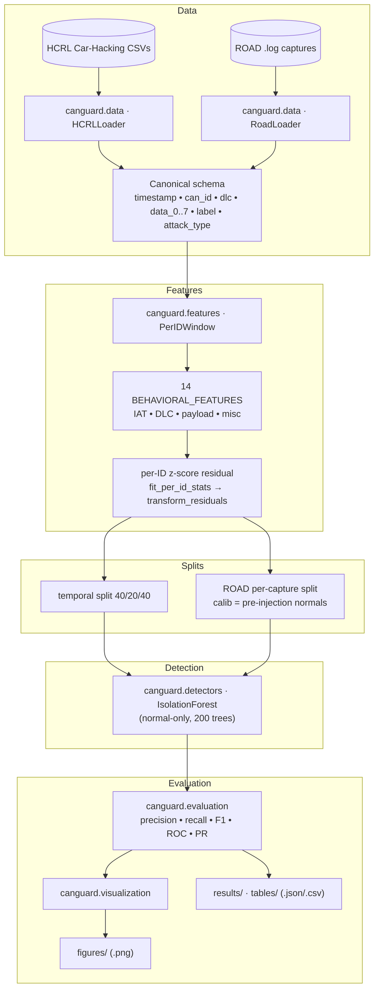

# CANguard

Behavioral CAN Bus Intrusion Detection System built on **Per-ID Behavioral Residual Detection (PIRD)**, validated on the synthetic HCRL Car-Hacking Dataset and the real ROAD dataset. Includes an IEEE-style research paper.

## System Architecture



**Pipeline**: per-ID sliding windows → 14 behavioral features → z-score residuals per ID → Isolation Forest (normal-only train) → metrics / figures / results.

**Evaluation pathways**
- **HCRL** — one continuous stream per attack → single 40/20/40 temporal split.
- **ROAD** — independent driving-session captures → per-capture split (residuals fitted on pre-injection normals), since temporal continuity does not span captures.

## Project Structure

| Path | Description |
|------|-------------|
| `src/canguard/` | Library: `data`, `features`, `transforms`, `detectors`, `evaluation`, `visualization`, `utils` |
| `papers/canguard_ieee.tex` | IEEE-style conference paper (LaTeX) |
| `paper/` | Revised paper build + `updated_figures`, `updated_tables` |
| `notebooks/` | Research notebooks: `eda_hcrl`, `feature_eng_hcrl`, `pird_hcrl`, `pird_v2_extensions` |
| `experiments/` | Config-driven runners: baseline, ROAD, and phase A/B/C pipelines |
| `experiments/configs/` | YAML configs: `hcrl.yaml`, `road.yaml`, `phase_a.yaml`, `phase_b_road.yaml`, `phase_c.yaml` |
| `tests/` | `pytest` suite (61 tests: loader + feature/residual/detector parity) |
| `tables/` | Consolidated result CSV/JSON (baselines, CIs, importance, latency, errors) |
| `run_pipeline.py` | One-command HCRL pipeline → `results/` + `figures/` |
| `figures/` | Generated diagnostic plots (`.png`) |
| `results/` | Machine-readable experiment metrics (`.json` / `.csv`) |
| `docs/road_validation.md` | ROAD dataset validation findings |
| `FINAL_REPORT*.md`, `PROJECT_AUDIT.md`, `EXPERIMENT_PLAN.md` | Research tracking / audit documents |
| `HCRL Car-Hacking/` | HCRL raw CSVs (git-ignored) |
| `road/` | ROAD raw dataset (git-ignored) |

## Setup

```bash
python3 -m venv .venv
.venv/bin/pip install -e ".[dev]"
.venv/bin/pytest
```

## Usage

```bash
# Run the HCRL pipeline and generate figures + results
.venv/bin/python run_pipeline.py

# Run a single experiment from a config
.venv/bin/python -m experiments.runners.train_detector --config experiments/configs/hcrl.yaml

# Validate PIRD on ROAD (per-capture)
.venv/bin/python -m experiments.runners.eval_road --config experiments/configs/road.yaml

# Research experiment phases (baselines, ROAD, statistics/runtime/latency)
.venv/bin/python -m experiments.runners.run_phase_a   --config experiments/configs/phase_a.yaml
.venv/bin/python -m experiments.runners.run_phase_b_road --config experiments/configs/phase_b_road.yaml
.venv/bin/python -m experiments.runners.run_phase_c   --config experiments/configs/phase_c.yaml
```

## Key Results (residual IF @ ~1% FPR, HCRL)

| Dataset | F1 | Recall | FPR |
|---------|-----|--------|-----|
| DoS | 0.017 | 0.01 | 0.055 |
| Fuzzy | 0.469 | 0.98 | 0.147 |
| RPM | 0.991 | 0.999 | 0.004 |
| gear | 0.945 | 0.998 | 0.032 |

Per-ID residuals work well on RPM/gear but **fail on DoS** (novel-ID flooding not captured by per-ID statistics). A supervised reference (HGB) reaches F1 = 1.0 on DoS/RPM/gear.

## ROAD Validation (residual IF, per capture)

| Attack type | F1 | Recall | FPR |
|-------------|-----|--------|-----|
| correlated_signal | 0.898 | 1.000 | 0.020 |
| fuzzing | 0.273 | 0.340 | 0.015 |
| max_engine_coolant_temp | 0.265 | 1.000 | 0.024 |
| max_speedometer | 0.698 | 1.000 | 0.038 |
| reverse_light_off | 0.657 | 1.000 | 0.048 |
| reverse_light_on | 0.544 | 0.997 | 0.053 |

PIRD generalizes to ROAD for **targeted single-AID attacks** (recall ≈ 1.0, near-perfect ROC/PR-AUC) even though ROAD reuses legitimate AIDs. It **does not** generalize to cross-ID fuzzing with the frozen per-ID configuration. See [`docs/road_validation.md`](docs/road_validation.md).


## Key Findings

- All 4 HCRL attacks are **presence-based** — naive rules (new ID, dominant ID, constant byte) achieve F1 > 0.99.
- The per-ID residual transform is the **enabling operator** (raw features alone are near-useless; ablation in the paper).
- **Dataset limitation**: near-perfect scores on HCRL do not prove generalization to stealth attacks that reuse legitimate IDs; ROAD validates the harder setting.

## License

This project is licensed under the [Apache License 2.0](LICENSE).
