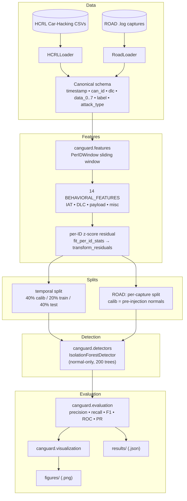
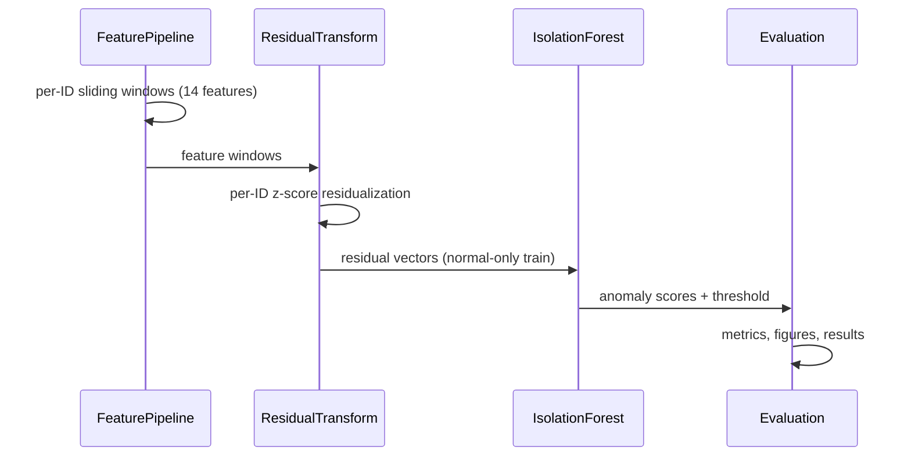

# CANguard

Behavioral CAN Bus Intrusion Detection System (Per-ID Behavioral Residual Detection, PIRD), validated on the HCRL Car-Hacking Dataset and the ROAD dataset.

## System Architecture



**Pipeline**: per-ID sliding windows → 14 behavioral features → z-score residuals per ID → Isolation Forest (normal-only train) → metrics / figures / results.

**Evaluation pathways**
- **HCRL** — one continuous stream per attack → single 40/20/40 temporal split.
- **ROAD** — independent driving-session captures → per-capture split (residuals fitted on pre-injection normals), since temporal continuity does not span captures.

## Data Flow



## Project Structure

| Path | Description |
|------|-------------|
| `src/canguard/` | Library: `data`, `features`, `detectors`, `evaluation`, `visualization` |
| `notebooks/` | Research notebooks: `eda_hcrl`, `feature_eng_hcrl`, `pird_hcrl`, `pird_v2_extensions` |
| `experiments/` | Config-driven CLI runners (`--config *.yaml`) |
| `tests/` | `pytest` suite (51 tests) |
| `configs/` | Experiment config files (`hcrl.yaml`, `road.yaml`) |
| `run_pipeline.py` | One-command HCRL pipeline runner → `results/` + `figures/` |
| `figures/` | Generated diagnostic plots (`.png`) |
| `results/` | Machine-readable metrics (`.json`) |
| `docs/road_validation.md` | ROAD dataset validation findings |
| `HCRL Car-Hacking/` | HCRL raw CSVs (git-ignored) |
| `road/` | ROAD raw dataset (git-ignored) |

## Setup

```bash
python3 -m venv .venv
.venv/bin/pip install -e ".[dev]"
.venv/bin/pytest
```

## Usage

```bash
# Run the HCRL pipeline and generate figures + results
.venv/bin/python run_pipeline.py

# Run a single experiment from a config
.venv/bin/python -m experiments.runners.train_detector --config experiments/configs/hcrl.yaml

# Validate PIRD on ROAD (per-capture)
.venv/bin/python -m experiments.runners.eval_road --config experiments/configs/road.yaml
```

## Key Results (residual IF @ ~1% FPR, HCRL)

| Dataset | F1 | Recall | FPR |
|---------|-----|--------|-----|
| DoS | 0.017 | 0.01 | 0.055 |
| Fuzzy | 0.469 | 0.98 | 0.147 |
| RPM | 0.991 | 0.999 | 0.004 |
| gear | 0.945 | 0.998 | 0.032 |

Per-ID residuals work well on RPM/gear but **fail on DoS** (novel-ID flooding not captured by per-ID statistics). Supervised reference (HGB) reaches F1 = 1.0 on DoS/RPM/gear.

## ROAD Validation (residual IF, per capture)

| Attack type | F1 | Recall | FPR |
|-------------|-----|--------|-----|
| correlated_signal | 0.898 | 1.000 | 0.020 |
| fuzzing | 0.273 | 0.340 | 0.015 |
| max_engine_coolant_temp | 0.265 | 1.000 | 0.024 |
| max_speedometer | 0.698 | 1.000 | 0.038 |
| reverse_light_off | 0.657 | 1.000 | 0.048 |
| reverse_light_on | 0.544 | 0.997 | 0.053 |

PIRD generalizes to ROAD for **targeted single-AID attacks** (recall ≈ 1.0,
near-perfect ROC/PR-AUC) even though ROAD reuses legitimate AIDs. It **does not**
generalize to cross-ID fuzzing with the frozen per-ID configuration. See
[`docs/road_validation.md`](docs/road_validation.md).

## Key Findings

- All 4 HCRL attacks are **presence-based** — naive rules (new ID, dominant ID, constant byte) achieve F1 > 0.99
- Behavioral features separate normal vs attack but do not generalize trivially
- **Dataset limitation**: near-perfect scores on HCRL do not prove generalization to stealth attacks that reuse legitimate IDs

## Recommended Harder Benchmarks

- [ROAD](https://www.nist.gov/programs-projects/road-real-ornl-automotive-drivermodel-data) — attacks injected over legitimate IDs
- can-train-and-test — synthetic CAN attacks with configurable stealth level

## License

This project is licensed under the [Apache License 2.0](LICENSE).
