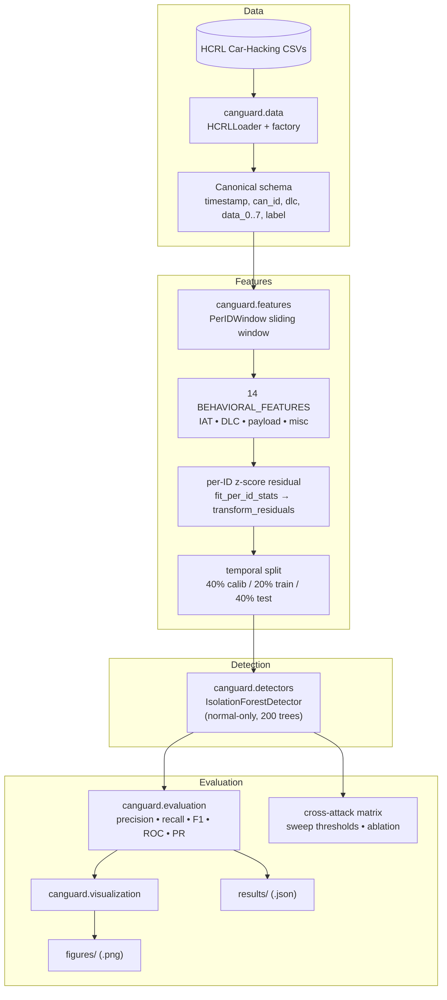
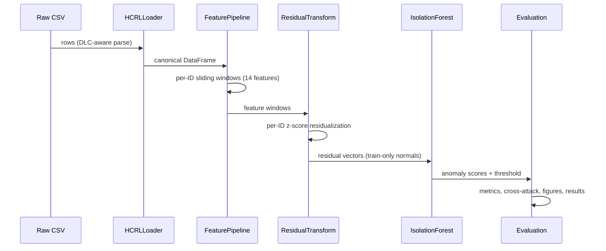

# CANguard

Behavioral CAN Bus Intrusion Detection System using the HCRL Car-Hacking Dataset (DoS, fuzzing, RPM spoofing, gear spoofing — Hyundai YF Sonata).

## System Architecture



**Pipeline**: per-ID sliding windows → 14 behavioral features → z-score residuals per ID → Isolation Forest (normal-only train) → metrics / figures / results.

## Data Flow



## Project Structure

| Path | Description |
|------|-------------|
| `src/canguard/` | Library: `data`, `features`, `detectors`, `evaluation`, `visualization` |
| `notebooks/` | Research notebooks: `eda_hcrl`, `feature_eng_hcrl`, `pird_hcrl`, `pird_v2_extensions` |
| `experiments/` | Config-driven CLI runners (`--config *.yaml`) |
| `tests/` | `pytest` suite (45 tests) |
| `configs/` | Experiment config files |
| `run_pipeline.py` | One-command full pipeline runner → `results/` + `figures/` |
| `figures/` | Generated diagnostic plots (`.png`) |
| `results/` | Machine-readable metrics (`.json`) |
| `HCRL Car-Hacking/` | Raw dataset CSVs (git-ignored) |

## Setup

```bash
python3 -m venv .venv
.venv/bin/pip install -e ".[dev]"
.venv/bin/pytest
```

## Usage

```bash
# Run the full pipeline and generate figures + results
.venv/bin/python run_pipeline.py

# Or run a single experiment from a config
.venv/bin/python -m experiments.runners.train_detector --config experiments/configs/hcrl.yaml
```

## Key Results (residual IF @ ~1% FPR)

| Dataset | F1 | Recall | FPR |
|---------|-----|--------|-----|
| DoS | 0.017 | 0.01 | 0.055 |
| Fuzzy | 0.469 | 0.98 | 0.147 |
| RPM | 0.991 | 0.999 | 0.004 |
| gear | 0.945 | 0.998 | 0.032 |

Per-ID residuals work well on RPM/gear but **fail on DoS** (novel-ID flooding not captured by per-ID statistics). Supervised reference (HGB) reaches F1 = 1.0 on DoS/RPM/gear.

## Key Findings

- All 4 HCRL attacks are **presence-based** — naive rules (new ID, dominant ID, constant byte) achieve F1 > 0.99
- Behavioral features separate normal vs attack but do not generalize trivially
- **Dataset limitation**: near-perfect scores on HCRL do not prove generalization to stealth attacks that reuse legitimate IDs

## Recommended Harder Benchmarks

- [ROAD](https://www.nist.gov/programs-projects/road-real-ornl-automotive-drivermodel-data) — attacks injected over legitimate IDs
- can-train-and-test — synthetic CAN attacks with configurable stealth level

## License

This project is licensed under the [Apache License 2.0](LICENSE).
