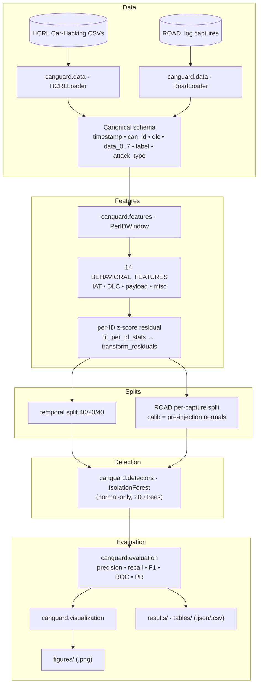

# CANguard

A behavioral CAN bus intrusion detection approach based on **Per-ID Behavioral Residual Detection (PIRD)**, evaluated on the synthetic HCRL Car-Hacking dataset and the real-world ROAD dataset.

## Paper & Citation

A manuscript describing this work is available as an arXiv preprint (not yet peer-reviewed):

- **arXiv:** [2608.05548](https://arxiv.org/abs/2608.05548) — *"Behavioral Residualization for Unsupervised Intrusion Detection in Automotive CAN Networks"*

## System Architecture

```mermaid
flowchart TD
    subgraph Data
        H[("HCRL Car-Hacking CSVs")] --> HL["canguard.data · HCRLLoader"]
        R[("ROAD .log captures")] --> RL["canguard.data · RoadLoader"]
        HL --> CS["Canonical schema<br/>timestamp • can_id • dlc • data_0..7 • label • attack_type"]
        RL --> CS
    end

    subgraph Features
        CS --> Win["canguard.features · PerIDWindow"]
        Win --> BF["14 BEHAVIORAL_FEATURES<br/>IAT • DLC • payload • misc"]
        BF --> Res["per-ID z-score residual<br/>fit_per_id_stats → transform_residuals"]
    end

    subgraph Splits
        Res --> TR["temporal split 40/20/40"]
        Res --> PC["ROAD per-capture split<br/>calib = pre-injection normals"]
    end

    subgraph Detection
        TR --> IF["canguard.detectors · IsolationForest<br/>(normal-only, 200 trees)"]
        PC --> IF
    end

    subgraph Evaluation
        IF --> M["canguard.evaluation<br/>precision • recall • F1 • ROC • PR"]
        M --> V["canguard.visualization"]
        V --> F["figures/ (.png)"]
        M --> O["results/ · tables/ (.json/.csv)"]
    end
```

**Pipeline**: per-ID sliding windows → 14 behavioral features → z-score residuals per ID → Isolation Forest (normal-only train) → metrics / figures / results.

**Evaluation pathways**
- **HCRL** — one continuous stream per attack → single 40/20/40 temporal split.
- **ROAD** — independent driving-session captures → per-capture split (residuals fitted on pre-injection normals), since temporal continuity does not span captures.

## Project Structure

| Path | Description |
|------|-------------|
| `src/canguard/` | Library: `data`, `features`, `transforms`, `detectors`, `evaluation`, `visualization`, `utils` |
| `papers/canguard_ieee.tex` | IEEE-style conference paper draft (LaTeX) |
| `paper/` | Revised paper build + `updated_figures`, `updated_tables` |
| `notebooks/` | Research notebooks: `eda_hcrl`, `feature_eng_hcrl`, `pird_hcrl`, `pird_v2_extensions` |
| `experiments/` | Config-driven runners: baseline, ROAD, and phase A/B/C pipelines |
| `experiments/configs/` | YAML configs: `hcrl.yaml`, `road.yaml`, `phase_a.yaml`, `phase_b_road.yaml`, `phase_c.yaml` |
| `tests/` | `pytest` suite (61 tests: loader + feature/residual/detector parity) |
| `tables/` | Consolidated result CSV/JSON (baselines, CIs, importance, latency, errors) |
| `run_pipeline.py` | One-command HCRL pipeline → `results/` + `figures/` |
| `figures/` | Generated diagnostic plots (`.png`) |
| `results/` | Machine-readable experiment metrics (`.json` / `.csv`) |
| `docs/road_validation.md` | ROAD dataset validation findings |
| `FINAL_REPORT*.md`, `PROJECT_AUDIT.md`, `EXPERIMENT_PLAN.md` | Research tracking / audit documents |
| `HCRL Car-Hacking/` | HCRL raw CSVs (git-ignored) |
| `road/` | ROAD raw dataset (git-ignored) |

## About

Modern vehicles use the **CAN (Controller Area Network) bus** to carry messages between electronic control units (ECUs). CAN has no built-in authentication or encryption, so a party with physical or remote access to the bus can inject or manipulate messages related to systems such as brakes, steering, or the engine.

**CANguard** is an unsupervised, behavior-based intrusion detection approach for automotive CAN networks. Rather than inspecting raw message fields directly, it models the *normal* behavior of each CAN identifier (ID) over sliding windows — timing (inter-arrival times), Data Length Code (DLC) statistics, and payload patterns — and converts those signals into per-ID **z-score residuals**. Windows that deviate significantly from an ID's learned normal behavior are flagged as anomalous.

The central idea tested here is that per-ID residualization matters: on the datasets evaluated, raw features alone perform poorly for detection, while modeling each ID's own distribution and expressing deviations as residuals lets a downstream anomaly detector separate benign from malicious traffic more effectively. This is evaluated directly via an ablation (see paper).

## How It Works

1. **Data loading** — Parses two datasets: the HCRL Car-Hacking dataset (synthetic CAN traffic with injected attacks) and the ROAD dataset (real recorded driving sessions with stealthier attacks).
2. **Feature engineering** — Messages are organized into per-ID sliding windows, each summarized by behavioral features (timing, DLC, and payload-based statistics).
3. **Residualization** — A statistical profile is fit per CAN ID over the windows, then used to transform each window into a per-ID z-score residual relative to that ID's normal behavior.
4. **Detection** — An unsupervised Isolation Forest is trained on normal-only traffic and scores new windows; anomalies are flagged by departure from the learned residual distribution.
5. **Evaluation** — Measured with precision, recall, F1, and ROC/PR curves, rendered as diagnostic figures and machine-readable tables.

## Key Characteristics

- **Unsupervised, per-ID detection** — training does not require labeled attack data; detection is driven by learning normal per-ID behavior.
- **Evaluated on two datasets with different attack realism** — HCRL (controlled, synthetic attacks) and ROAD (real driving sessions with stealthier attacks that reuse legitimate IDs), which lets the results be checked for whether they hold up beyond the easier, synthetic setting.
- **Documented methodology** — the accompanying paper describes the residualization operator and reports an ablation isolating its contribution.

## Key Results (HCRL)

| Dataset | F1 | Recall | FPR |
|---------|-----|--------|-----|
| DoS | 0.017 | 0.01 | 0.055 |
| Fuzzy | 0.469 | 0.98 | 0.147 |
| RPM | 0.991 | 0.999 | 0.004 |
| gear | 0.945 | 0.998 | 0.032 |

Per-ID residuals perform well on RPM/gear but **fail on DoS** — novel-ID flooding is not captured by per-ID statistics, since DoS in this dataset is presence-based rather than a behavioral deviation of an existing ID. A supervised reference model (HGB), trained with labeled attacks, reaches F1 = 1.0 on DoS/RPM/gear; this is a different problem setting (supervised vs. unsupervised) and the comparison should be read as such, not as a direct apples-to-apples baseline.

## ROAD Validation (residual IF, per capture)

| Attack type | F1 | Recall | FPR |
|-------------|-----|--------|-----|
| correlated_signal | 0.898 | 1.000 | 0.020 |
| fuzzing | 0.273 | 0.340 | 0.015 |
| max_engine_coolant_temp | 0.265 | 1.000 | 0.024 |
| max_speedometer | 0.698 | 1.000 | 0.038 |
| reverse_light_off | 0.657 | 1.000 | 0.048 |
| reverse_light_on | 0.544 | 0.997 | 0.053 |

The method generalizes to ROAD for **targeted single-AID attacks** (recall ≈ 1.0 on those attack types) even though ROAD reuses legitimate AIDs, which is a harder setting than HCRL. It does **not** generalize well to cross-ID fuzzing under the frozen per-ID configuration (F1 = 0.273, recall = 0.340) — this is a genuine limitation, not an edge case to gloss over. See [`docs/road_validation.md`](docs/road_validation.md) for the full breakdown.

## Limitations

- **DoS detection is a known failure mode.** The per-ID residual approach is not well-suited to novel-ID flooding attacks, since these are detectable by ID *presence* rather than behavioral deviation of a tracked ID. A presence-based rule or a supervised model would likely be needed to cover this attack type in a deployed system.
- **Cross-ID fuzzing on ROAD is weak** (F1 = 0.273). The frozen per-ID configuration does not capture attacks that manipulate patterns across multiple IDs rather than deviating a single ID's behavior.
- **HCRL results alone would overstate performance.** Naive presence-based rules already reach F1 > 0.99 on all four HCRL attack types, meaning HCRL's synthetic attacks are easier than realistic in-vehicle attacks; ROAD results are the more meaningful indicator of real-world performance.
- **Supervised comparison is not apples-to-apples.** The HGB reference uses labeled attack data during training; CANguard's approach does not. The comparison illustrates a ceiling, not a fair head-to-head.
- **Preprint status.** The accompanying paper is an arXiv preprint and has not undergone peer review.

## License

This project is licensed under the [Apache License 2.0](LICENSE).
